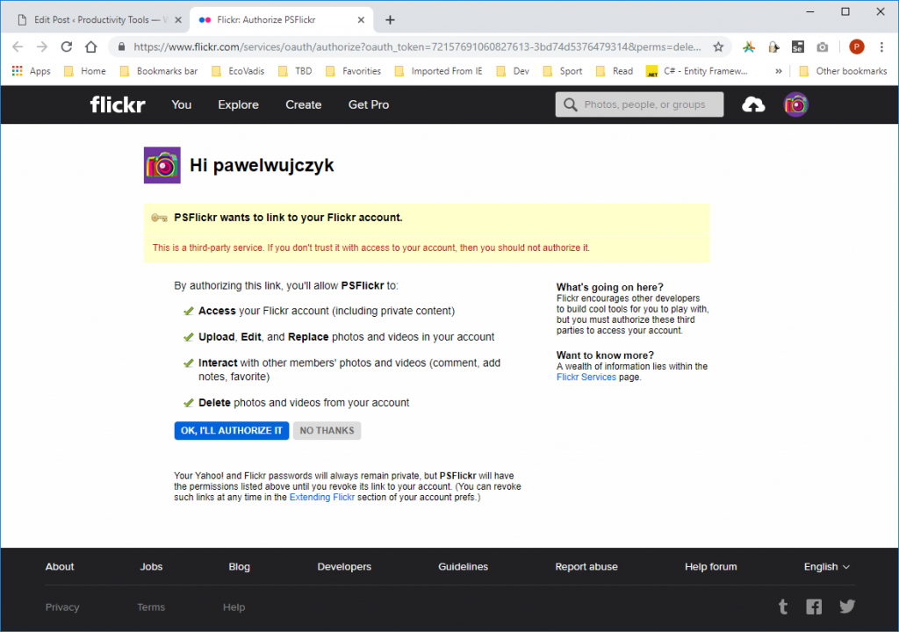
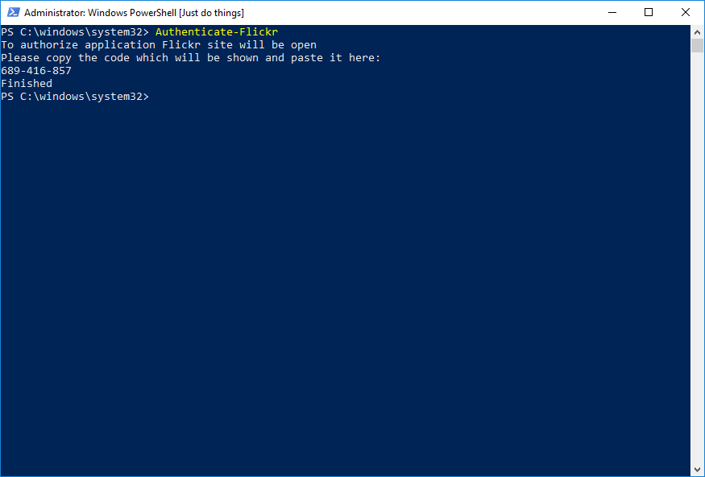
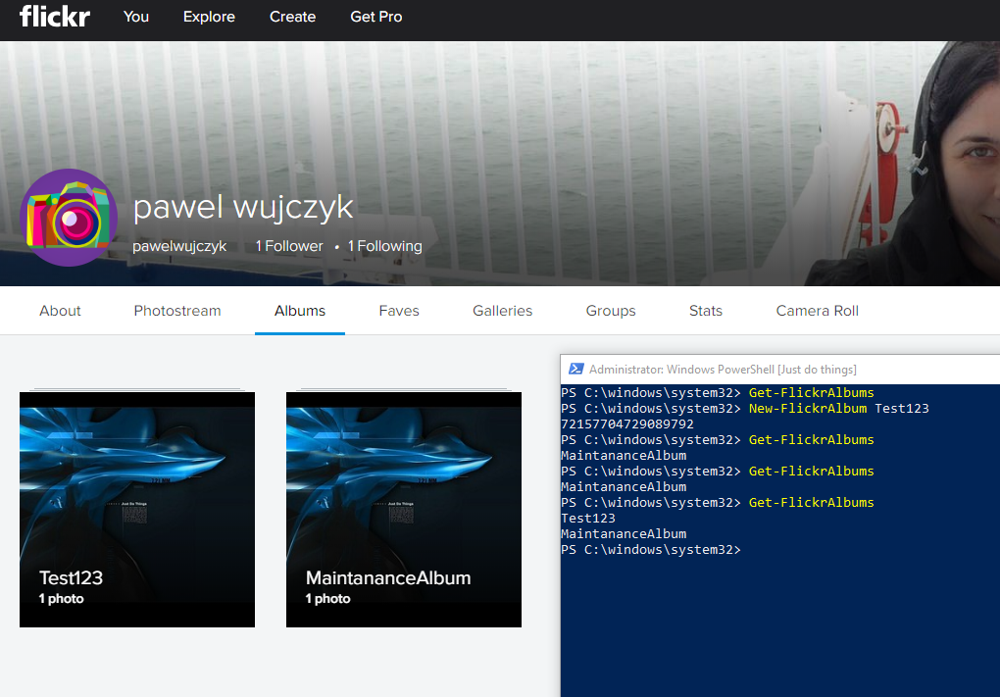

<!--Category:Powershell,C#--> 
 <p align="right">
    <a href="https://www.powershellgallery.com/packages/ProductivityTools.PSFlickr/"></a>
    <a href="http://productivitytools.tech/psflickr/"><a> 
    <a href="https://github.com/pwujczyk/ProductivityTools.PSFlickr"></a>
</p>
<p align="center">
    <a href="http://productivitytools.tech/">
        
    </a>
</p>

# PSFlickr

Module allows to perform basic operations on the Flickr account. Main feature is to synchronize whole photo directories with online albums.

<!--more-->

## **Project was dropped when Flickr decided to limit free account to 1000 pictures for account.**

Current state: module can authenticate, create directories, push pictures to albums.

Below is placed documentation done during development.

---

After installing module you must perform authentication. (If you won’t do it you will receive error:

To authenticate please invoke command

```powershell
Authenticate-Flickr
```


If authentication will be performed correctly you should see simple Finished information.



After authentication you can start using module. It is important to know that Flickr API is asynchronous, and a lot of operations are not visible just after invoking. Example below shows, that after creating album, we needed to wait couple seconds to see result.

Additionally Flickr Album cannot exists without any picture. If you will remove all pictures from album album is deleted automatically. That is why when creating album through API you need to add at least one photo. In module we I am creating Maintenance Album which stores one picture which is added to newly created album. After you will add picture to this album. Maintenance picture is removed (from this new album)

<!--og-image-->


- Authenticate-Flickr – Authenticate module to your account. Saves key to MasterConfiguration file placed in the module directory.
- Clear-Flickr – remove all photos and albums from Flickr.
- Delete-FlickrAlbum – removes all photos from album, album is deleted automatically
- Get-FlickrAlbums – obvious
- Move-FlickrSinglePhotosToAlbum – you are adding photos to Flickr and you can group it in albums. - One photo can be in many albums. This module mainly focuses on albums, so to manage not assigned - photo to any album, you could use this command
- New-FlickrAlbum – obvious
- Add-FlickrPhoto – obvious
- Sync-FlickrSet – most power-full command here described below
- Sync-FlickrAlbumFromDirectory – sync only one directory used by Sync-FlickrSet in a loop
- Set-FlickrAlbumPermissions – obvious
- Set-FlickrPhotoPermissions – obvious